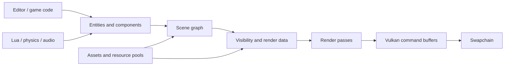

# Architecture

Mikoto is organized around a practical split: the editor composes engine services, the runtime owns the world, and the renderer translates that world into Vulkan work.

## Core boundaries

| Area | Responsibility |
| --- | --- |
| **Application/editor** | Windows, input, ImGui panels, scene authoring, and tools |
| **World** | Entities, components, transforms, hierarchy, and scene state |
| **Resources** | Models, images, materials, shaders, pools, and lifetime management |
| **Renderer** | GPU resources, render passes, lighting, queues, and presentation |
| **Services** | Physics, audio, Lua scripting, networking, and profiling |

The current `develop` architecture emphasizes resource pools, automatic cleanup, and reusable render-pass abstractions. These are important because explicit ownership and predictable lifetime are the difference between a renderer that is debuggable and one that only works by accident.

## Data flow

## Design principles

- **Make the GPU path visible.** Abstractions should reduce repetition without hiding synchronization, ownership, or cost.
- **Prefer focused systems.** Rendering, physics, audio, and scripting can evolve without becoming one giant subsystem.
- **Build to learn.** A feature is valuable when it makes a graphics concept concrete and inspectable.
- **Keep the editor close to the runtime.** The editor is a consumer of the engine, not a parallel implementation of it.

## Where to read next

- [Rendering](rendering.md) for the frame path and shader stack.
- [World & assets](world-and-assets.md) for ECS and resource loading.
- [Repository map](../reference/repository-map.md) for source locations.
